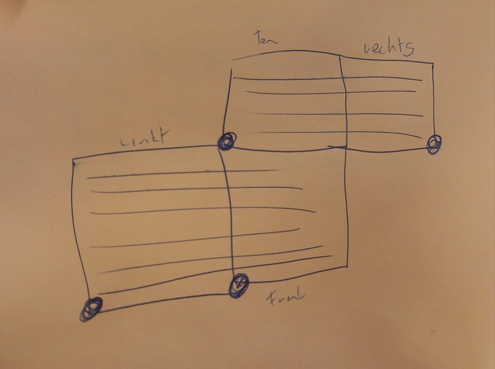

# Gigacube

This repo is a fork of [mucer/dots_n_boxes](https://github.com/mucer/dots_n_boxes), a project which was done during the [Hacken mit Licht](https://hacken-mit-licht.de) Hackathon.

<p>

</p>

# TODO
- fix corners and direction controls
- make LED brightness adjustable
- mark the edges where you die in e.g. red
- add support for mulitple nunchucks in the faradaycage. E.g with buttons for switching between them so that any number of nunchucks are supported.

## Hardware

900 Pixels are available at a density of 60 Pixels per Meter.

The basis of the game is a 25x25x25cm cube. 4 sides of the cube are being used, amounting to 15x15 pixels on each used side:

- 15\*45 pixels in total from left to right
- 15\*15 pixels on the top

The game can be played with 1 (front), 3 (front, top, left) or 4 sides (front, top, left, right).

UP is considered starting by the front side. That means moving UP at the top side corresponds to "to the back".

## Architecture

- For each pixel 2 player states are stored
- A player state contains
  - atPosition: is the player currently at this position?
  - hasTrail: does the player currently have a trail?
  - ownedBy: does player have this pixel captured?
- A pixel can be addressed by 
  - side [0=left, 1=front, 2=right, 3=top]
  - x [0-15]
  - y [0-15]
  - player [0,1]
- The main class is responsible for orchestration
  - Execute a tick every x milliseconds
  - Read controls
  - Play animations
  - Start / end game
  - Render a UI frame (UI can be updated more often per tick to render effects)

## Run commands

|Command|Explanation|
|---|---|
|`deploy/npmCi`|Deploy webserver|
|`reset/cleanEclipse`|Reset game|
|`run/buildCommand`|Start game|

## Faradaycage

The `faradaycage` is a nix-shell for virtualizing the Gigacube. The main idea is to develop for the cube without having to be physical next to it. The cube is visualized with pygame. 

Of course this is not a full emulation of the hardware. It supports the basic functions of the `neopixel` libary. All functions of the `DisplayController` are supported.

**Important:** It is not possible to replace the `time` libary in the nix-shell because it is a build-in libary (at least that is the current knowledge. PRs are welcomed :). Therefore the emulated libary is namend `timeE`. To run a skript change the import statements in the affected files.

### Usage

```
nix develop .#faradaycage

python main.py # starts the script simaliar to 'run/buildCommand'.
```

The cube can be roteated with `w, a, s, d`. The nunchuk input is controlled over the arrowkeys. Note that if you have multiple nunchuks they all get the same input.
